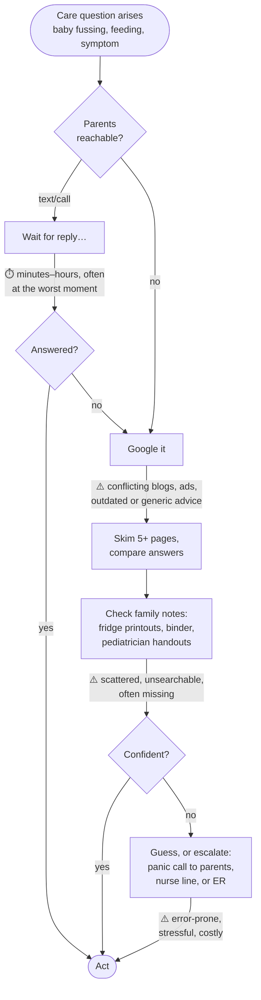

# Certification Challenge — NestNote: Infant Care Assistant (0–24 months)

> Submission for the AI Engineering Certification Challenge (AI Makerspace).
> Live app: _TODO (Step 4)_ · Demo video: _TODO (Step 7)_

---

## Task 1: Defining the Problem, Audience, and Scope

### 1.1 Problem statement (one sentence)

Babysitters and parents caring for an infant (0–24 months) cannot quickly get trustworthy answers to everyday care questions that account for *this specific baby's* age, allergies, and routines.

### 1.2 Why this is a problem for our user

Our user is a **babysitter or a new parent** who is alone with a baby and needs an answer *right now*: How much formula does a 6-month-old take? Is this fever something to worry about? Can she have honey yet? Why won't he settle for his nap? Infant care is uniquely unforgiving — the answers change month by month as the baby develops (what's safe at 12 months is dangerous at 6), and the stakes of getting it wrong (choking hazards, unsafe sleep, allergen exposure) are far higher than in almost any other domain of everyday life. Babysitters face an extra layer of the problem: they don't know this baby's history, and the parents are exactly the people they can't easily reach — they're out.

Today, caregivers cope with a patchwork: they text the parents and wait, they Google and get a wall of conflicting mommy-blogs, ad-laden listicles, and outdated advice, or they dig through the family's handwritten notes, fridge printouts, and pediatrician handout folder. None of these is good enough. Texting is slow and often goes unanswered at the worst moment. Web search is generic — it doesn't know the baby is 7 months old, allergic to eggs, and on a specific nap schedule — and forces a stressed caregiver to adjudicate between contradictory sources under time pressure. And the family's own notes, the most relevant information of all, are scattered, unsearchable, and usually not where the caregiver is standing. The result: slow answers, guesswork, unnecessary panic calls, and occasionally genuinely unsafe decisions.

### 1.3 How the user solves this problem today (workflow diagram)

The slow points are the waits (texting parents); the error-prone points are generic web results that ignore the baby's age and history, and scattered family notes that can't be searched.

### 1.4 Evaluation questions

Questions our application must answer well, spanning the corpus (guidelines), the family notes (baby-specific), and live web search:

| # | Question | Expected answer grounds |
|---|---|---|
| 1 | How much formula should a 6-month-old drink per feeding? | Feeding guidelines (≈6–8 oz per feeding, 4–5×/day) |
| 2 | When can babies start eating solid foods? | Feeding guidelines (~6 months, readiness signs) |
| 3 | Is honey safe for a 10-month-old? | Safety guidelines (no — botulism risk before 12 months) |
| 4 | My baby is 4 months old with a 38.2 °C fever — what should I do? | Health guidelines (contact pediatrician; <3 months = emergency) |
| 5 | How should I put the baby down to sleep safely? | Safe-sleep guidelines (back, firm surface, nothing in crib) |
| 6 | How many naps does a 9-month-old typically take? | Sleep guidelines (2 naps) |
| 7 | What do I do if the baby is choking? | Choking/CPR guidance (back blows/chest thrusts by age) |
| 8 | What foods are choking hazards for a 1-year-old? | Safety guidelines (grapes, nuts, hot dogs…) |
| 9 | When should a baby be able to sit up on their own? | Milestone guidelines (~6 months) |
| 10 | Is it normal that my 8-month-old isn't crawling yet? | Milestone guidelines (range; when to ask pediatrician) |
| 11 | How do I safely warm a bottle of breast milk? | Feeding guidelines (warm water, never microwave) |
| 12 | How long can formula sit out before it's unsafe? | Feeding guidelines (1–2 hours) |
| 13 | What's a good bedtime routine for a 1-year-old? | Sleep guidelines |
| 14 | The baby has a diaper rash — what should I do? | Care guidelines (air, barrier cream; when to escalate) |
| 15 | Does *this* baby have any food allergies I should know about? | **Family notes / baby profile (memory)** |
| 16 | What's the baby's usual nap schedule? | **Family notes / baby profile (memory)** |
| 17 | Have there been any recent recalls of [specific formula brand]? | **Tavily live web search** |
| 18 | What's the current guidance on peanut introduction? | Guidelines + Tavily (current advisories) |
| 19 | Can a 15-month-old drink cow's milk? | Feeding guidelines (yes, whole milk after 12 months) |
| 20 | The baby fell off the couch and is crying — what do I check? | Health guidelines (warning signs; when to call 911) |

---

## Task 2: Proposed Solution

### 2.1 Solution (one sentence)

_TODO_

### 2.2 Infrastructure diagram and tooling choices

_TODO — Mermaid diagram + one sentence per component_

### 2.3 Agent workflow diagram

_TODO — Mermaid diagram + 1–2 explanatory paragraphs_

---

## Task 3: Dealing with the Data

### 3.1 Data sources and external APIs

_TODO_

### 3.2 Default chunking strategy and rationale

_TODO_

---

## Task 4: End-to-End Agentic RAG Prototype

### 4.1 Architecture notes

_TODO_

### 4.2 Deployment

_TODO — public URL, hosting details_

---

## Task 5: Evaluation

### 5.1 Test dataset

_TODO_

### 5.2 Evaluation harness

_TODO_

### 5.3 Baseline results and conclusions

_TODO — metric table + interpretation_

---

## Task 6: Improving the Prototype

### 6.1 Advanced retrieval technique

_TODO — technique + why it fits this use case_

### 6.2 Performance comparison

_TODO — baseline vs. advanced table_

### 6.3 Second improvement (with eval evidence)

_TODO_

---

## Task 7: Next Steps

_TODO — keep vs. change for Demo Day_
