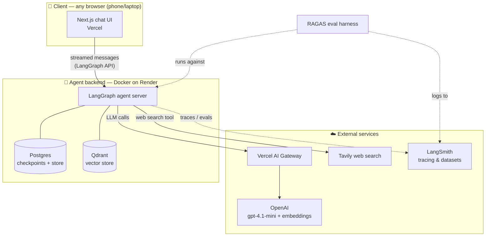
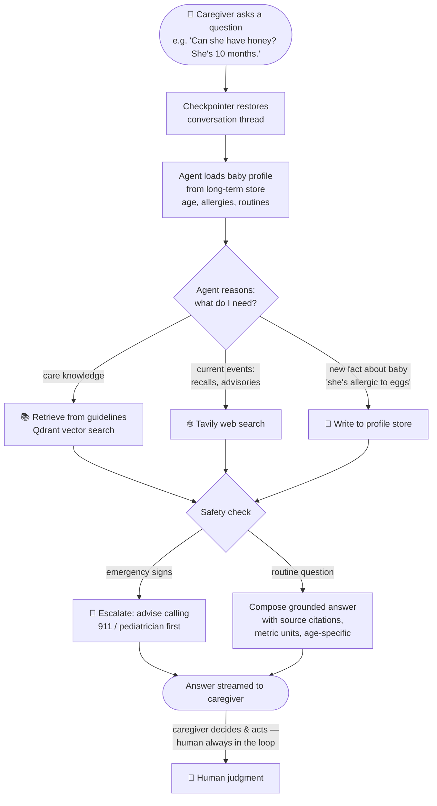

# Certification Challenge — BeeDoula 🐝: Infant Care Assistant (0–24 months)

> Submission for the AI Engineering Certification Challenge (AI Makerspace).
> Live app: _TODO (Step 4)_ · Demo video: _TODO (Step 7)_

---

## Task 1: Defining the Problem, Audience, and Scope

### 1.1 Problem statement (one sentence)

Babysitters and parents caring for an infant (0–24 months) cannot quickly get trustworthy answers to everyday care questions that account for *this specific baby's* age, allergies, and routines.

### 1.2 Why this is a problem for our user

Our user is a **babysitter or a new parent** who is alone with a baby and needs an answer *right now*: How much formula does a 6-month-old take? Is this fever something to worry about? Can she have honey yet? Why won't he settle for his nap? Infant care is uniquely unforgiving — the answers change month by month as the baby develops (what's safe at 12 months is dangerous at 6), and the stakes of getting it wrong (choking hazards, unsafe sleep, allergen exposure) are far higher than in almost any other domain of everyday life. Babysitters face an extra layer of the problem: they don't know this baby's history, and the parents are exactly the people they can't easily reach — they're out.

Today, caregivers cope with a patchwork: they text the parents and wait, they Google and get a wall of conflicting mommy-blogs, ad-laden listicles, and outdated advice, or they dig through the family's handwritten notes, fridge printouts, and pediatrician handout folder. None of these is good enough. Texting is slow and often goes unanswered at the worst moment. Web search is generic — it doesn't know the baby is 7 months old, allergic to eggs, and on a specific nap schedule — and forces a stressed caregiver to adjudicate between contradictory sources under time pressure. And the family's own notes, the most relevant information of all, are scattered, unsearchable, and usually not where the caregiver is standing. The result: slow answers, guesswork, unnecessary panic calls, and occasionally genuinely unsafe decisions.

### 1.3 How the user solves this problem today (workflow diagram)

The slow points are the waits (texting parents); the error-prone points are generic web results that ignore the baby's age and history, and scattered family notes that can't be searched.

### 1.4 Evaluation questions

Questions our application must answer well, spanning the corpus (guidelines), the family notes (baby-specific), and live web search:

| # | Question | Expected answer grounds |
|---|---|---|
| 1 | How much formula should a 6-month-old drink per feeding? | Feeding guidelines (≈180–240 ml per feeding, 4–5×/day) |
| 2 | When can babies start eating solid foods? | Feeding guidelines (~6 months, readiness signs) |
| 3 | Is honey safe for a 10-month-old? | Safety guidelines (no — botulism risk before 12 months) |
| 4 | My baby is 4 months old with a 38.2 °C fever — what should I do? | Health guidelines (contact pediatrician; <3 months = emergency) |
| 5 | How should I put the baby down to sleep safely? | Safe-sleep guidelines (back, firm surface, nothing in crib) |
| 6 | How many naps does a 9-month-old typically take? | Sleep guidelines (2 naps) |
| 7 | What do I do if the baby is choking? | Choking/CPR guidance (back blows/chest thrusts by age) |
| 8 | What foods are choking hazards for a 1-year-old? | Safety guidelines (grapes, nuts, hot dogs…) |
| 9 | When should a baby be able to sit up on their own? | Milestone guidelines (~6 months) |
| 10 | Is it normal that my 8-month-old isn't crawling yet? | Milestone guidelines (range; when to ask pediatrician) |
| 11 | How do I safely warm a bottle of breast milk? | Feeding guidelines (warm water, never microwave) |
| 12 | How long can formula sit out before it's unsafe? | Feeding guidelines (1–2 hours) |
| 13 | What's a good bedtime routine for a 1-year-old? | Sleep guidelines |
| 14 | The baby has a diaper rash — what should I do? | Care guidelines (air, barrier cream; when to escalate) |
| 15 | Does *this* baby have any food allergies I should know about? | **Family notes / baby profile (memory)** |
| 16 | What's the baby's usual nap schedule? | **Family notes / baby profile (memory)** |
| 17 | Have there been any recent recalls of [specific formula brand]? | **Tavily live web search** |
| 18 | What's the current guidance on peanut introduction? | Guidelines + Tavily (current advisories) |
| 19 | Can a 15-month-old drink cow's milk? | Feeding guidelines (yes, whole milk after 12 months) |
| 20 | The baby fell off the couch and is crying — what do I check? | Health guidelines (warning signs; when to call 911) |

---

## Task 2: Proposed Solution

### 2.1 Solution (one sentence)

BeeDoula is an agentic RAG chat assistant that answers infant-care questions from vetted care guidelines and the family's own notes, remembers each baby's profile across conversations, and searches the live web for current advisories and recalls — in any browser, on phone or laptop.

### 2.2 Infrastructure diagram and tooling choices

Why each component:

| Component | Choice | Why |
|---|---|---|
| LLM | OpenAI `gpt-4.1-mini` | Strong instruction-following and tool-calling at a per-token cost low enough for a free-tier project. |
| LLM gateway | Vercel AI Gateway | Satisfies the gateway requirement with one OpenAI-compatible base URL, adding provider failover and spend visibility without code changes. |
| Agent orchestration | LangGraph | Gives us the agent loop, conditional tool-calling, and first-class checkpointer/store memory — and its server protocol is what our frontend streams against. |
| Tools | RAG retriever · Tavily · memory tools | Retriever grounds answers in vetted guidelines; Tavily covers what a static corpus can't (recalls, current advisories); memory tools read/write the baby's profile. |
| Embeddings | OpenAI `text-embedding-3-small` | Best cost/quality ratio for a small corpus; one vendor for LLM + embeddings keeps ops simple. |
| Vector DB | Qdrant | Runs in-process for dev and as a free managed cluster in production, with one identical LangChain interface for both. |
| Memory | LangGraph checkpointer (threads) + store (profile) | Checkpointer gives conversation continuity per thread; the store persists baby facts (allergies, routines) across threads — the hard memory requirement. |
| Monitoring | LangSmith (free tier) | Full traces of every agent run — which tools fired, what was retrieved — essential for debugging and for our eval harness. |
| Evaluation | RAGAS + LangSmith datasets | RAGAS provides RAG-specific metrics (faithfulness, context recall) out of the box; LangSmith stores the dataset and eval runs. |
| Frontend | Next.js + shadcn/ui on Vercel | Streaming chat UI with a proven `useStream` integration to LangGraph; Vercel free tier gives a public HTTPS URL that works on any phone. |
| Backend hosting | LangGraph Docker image on Render (free tier) | Render runs the long-lived agent server (with Postgres/Redis) that Vercel's serverless platform can't host — at zero cost. |

### 2.3 Agent workflow diagram

When a caregiver sends a message, the LangGraph checkpointer first restores the conversation thread (so "she" still means the same baby three messages later), and the agent loads the baby's profile from the long-term store — age, known allergies, routines — so every answer is specific to *this* child rather than a generic infant. The agent then reasons about what the question needs: care knowledge triggers retrieval from the vetted guidelines corpus in Qdrant (RAG); anything time-sensitive — product recalls, current advisories — triggers the Tavily web-search tool, because a static corpus can't know about last week's formula recall; and when the caregiver mentions a new fact about the baby ("she's allergic to eggs"), the agent writes it to the profile store so it's remembered in every future conversation.

Before answering, the agent applies a hard safety rule baked into its system prompt: if the situation involves emergency warning signs (fever under 3 months, trouble breathing, injury after a fall), the response leads with escalation — call 911 or the pediatrician — before any other information. Routine answers are composed from the retrieved context with source citations, in metric units, calibrated to the baby's age. The human is always in the loop by design: BeeDoula informs, but the caregiver decides and acts — the app never diagnoses or replaces medical judgment.

---

## Task 3: Dealing with the Data

### 3.1 Data sources and external APIs

**RAG corpus** (`data/`) — authoritative, freely distributable care guidance covering the four domains our eval questions probe:

| File | Source | Covers |
|---|---|---|
| `cdc_milestone_moments.pdf` | CDC "Learn the Signs. Act Early." Milestone Moments booklet | Developmental milestones (2 months–5 years), when to act early |
| `nichd_safe_sleep_for_your_baby.pdf` | NIH/NICHD Safe to Sleep® brochure | Safe sleep environment, SIDS risk reduction |
| `who_infant_young_child_feeding.pdf` | WHO Infant and Young Child Feeding model chapter | Breastfeeding, formula, complementary feeding 0–24 months |
| `aha_infant_cpr_choking_fact_sheet.pdf` | American Heart Association fact sheet | Infant choking response and CPR steps |
| `family_notes_sample.md` | Written by the family (fictional sample in this repo) | *This* baby: allergies, feeding amounts, nap schedule, house rules, pediatrician contacts |

The first four are the **vetted general knowledge**: they answer "what's true for babies of this age." The family notes are the **personal data** that makes answers specific: "what's true for *Mia*." Real family notes are never committed — they belong in a gitignored `data/family_notes_private.md`.

**External API — Tavily web search.** A static corpus cannot know about last week's formula recall or this month's updated advisory. The agent calls Tavily when a question is time-sensitive (recalls, current guidance, product safety) or falls outside the corpus.

**How they interact at runtime:** for a question like "Can Mia have scrambled eggs?", the agent combines all three layers — the family notes say Mia is allergic to eggs (personal), the WHO guide describes allergen introduction (general), and Tavily is available if the question had a current-events component (e.g., an egg-product recall). The agent's answer leads with the baby-specific fact, grounded by the guideline context.

### 3.2 Default chunking strategy and rationale

**Default: `RecursiveCharacterTextSplitter` with 750-token chunks (tiktoken-measured), no overlap** (`app/rag.py`).

Why:
1. **Our documents are section-structured.** Care guidelines are written as self-contained topical sections ("Safe sleep environment," "Feeding at 6–8 months," "Choking response steps"). 750 tokens is roughly one such section, so a chunk usually holds one complete, coherent answer unit — which is exactly what we want retrieved.
2. **Token-based measurement matches the embedding model's view.** Measuring chunk size in tokens (via tiktoken) rather than characters keeps chunks consistently sized from the model's perspective, avoiding chunks that blow past useful embedding length.
3. **Recursive splitting respects document structure.** The splitter breaks on paragraphs before sentences before words, so chunks tend to end at natural boundaries instead of mid-instruction — important when a chunk contains step-by-step safety instructions (choking response) that must not be cut in half.
4. **Zero overlap is a deliberate baseline.** It maximizes corpus coverage per embedding dollar and gives us a clean baseline to measure against; if evaluation (Task 5) shows boundary-loss problems, chunk overlap and **parent-child chunking** (retrieve small, return the surrounding section) are the planned Task 6 upgrades.

---

## Task 4: End-to-End Agentic RAG Prototype

### 4.1 Architecture notes

The prototype is the stack from the Task 2 diagrams, working end to end:

- **Agent** (`app/graphs/simple_agent.py`): LangGraph `create_agent` with a safety-first system prompt (emergency escalation before anything else, no diagnosis, metric units only, cite sources).
- **Tools** (`app/tools.py`): `retrieve_information` (RAG over the corpus + family notes), `tavily_search` (live web), `get_baby_profile` / `save_baby_fact` (long-term memory in the LangGraph store, namespace `("beedoula", "baby_profile")`).
- **LLM + embeddings** (`app/models.py`, `app/rag.py`): both routed through the Vercel AI Gateway with a single `vck_` key — no direct provider keys anywhere.
- **Frontend** (`frontend/`): Next.js streaming chat with an API passthrough that keeps keys server-side; tool activity is shown as labeled badges ("Care guidelines", "Baby profile", "Web search", "Remembering").

Verified end to end by two smoke tests (`smoke_test_local.py` in-process, `smoke_test_sdk.py` against the server): the agent answers care questions grounded in the WHO/NICHD/CDC/AHA corpus, saves a fact told in one conversation ("Mia is allergic to eggs"), and applies it in a *different* thread ("no scrambled eggs — your family notes say...").

### 4.2 Deployment

- **Backend**: LangGraph server (Docker/free tier) on Render — blueprint in `render.yaml`. _URL: TODO after deploy._
- **Frontend**: Vercel. _URL: TODO after deploy._

---

## Task 5: Evaluation

### 5.1 Test dataset

The dataset (`beedoula-eval-v1` in LangSmith, 29 examples, built by `evals/build_dataset.py`) combines two sources:

1. **9 synthetic examples** generated with the RAGAS `TestsetGenerator` over the guideline corpus, using the same Vercel AI Gateway models as the app. Corpus pages are merged per source and re-split into substantial sections first, because RAGAS's headline-extraction transforms fail on thin, image-heavy PDF pages.
2. **20 hand-written golden questions** from Task 1, each with a reference answer and a `kind` tag: `corpus` (answerable from the guidelines), `memory` (depends on the baby's saved profile), and `web` (requires live search). This deliberately covers all three retrieval paths of the agent, not just RAG.

### 5.2 Evaluation harness

The harness (`evals/run_evals.py`) is a rerunnable script, isolated in its own uv project so the pinned RAGAS build can't destabilize the app:

1. **Seeds the baby profile** through the agent server's store API (allergies, nap schedule, house rules matching the family notes), so memory questions are answerable and runs are reproducible.
2. **Runs the real agent** — not a stripped-down RAG chain — against each question in a fresh thread via the LangGraph SDK, capturing the final answer and every tool result (retrieval chunks, profile reads, web results) as the retrieved contexts.
3. **Scores three RAGAS metrics** with an LLM judge routed through the same gateway: **context recall** (did retrieval fetch the facts the reference needs?), **faithfulness** (is the answer grounded in what was retrieved?), and **answer accuracy** (does the answer match the reference?).
4. **Logs everything to LangSmith** as a named experiment (`EVAL_EXPERIMENT_PREFIX`) and writes a per-question CSV to `evals/out/` — so baseline vs. improved comparisons in Task 6 are one environment variable apart.

### 5.3 Baseline results and conclusions

Baseline (dense retrieval, k=4), experiment `baseline-clean-51b6438d`, 29/29 examples scored:

| Metric | Overall | corpus | memory | web |
|---|---|---|---|---|
| Context recall | **0.33** | 0.33 | 0.56 | 0.00 |
| Faithfulness | **0.40** | 0.40 | 0.53 | 0.14 |
| Answer accuracy | **0.65** | 0.66 | 0.83 | 0.25 |

**Conclusions:**

1. **Retrieval is the bottleneck.** A context recall of 0.33 means the dense retriever usually fails to fetch all the facts the reference answer needs. Care questions mix exact tokens (ages like "10 months", thresholds like "38 °C", terms like "honey", "botulism") with paraphrased phrasing — a known weakness of pure dense retrieval and a direct motivation for the hybrid (dense + BM25) upgrade in Task 6.
2. **The agent papers over retrieval gaps with parametric knowledge.** Answer accuracy (0.65) is much higher than faithfulness (0.40): when retrieval misses, the model answers from what it learned in training. Often correct — but in a safety domain we want verifiable, source-grounded answers, so faithfulness is the metric we most want to raise.
3. **Memory works.** Memory-kind questions score best across the board (accuracy 0.83), confirming the profile store pipeline retrieves and applies baby-specific facts.
4. **Web-kind scores are structurally noisy.** References for live-web questions describe expected *behavior* rather than fixed facts, so recall-against-reference is near zero by construction. We keep them in the set to watch answer accuracy, and treat their recall/faithfulness as a known limitation of the harness, not the agent.

---

## Task 6: Improving the Prototype

### 6.1 Advanced retrieval technique

**Hybrid retrieval: dense vectors + BM25, fused with reciprocal rank fusion (RRF).** Each query now runs both a dense similarity search and a BM25 lexical search over the same 750-token chunks (top-10 each), and RRF merges the two rankings into the final top-4 (`app/rag.py`, toggled by `RETRIEVER_MODE=hybrid`).

Why it fits this use case: infant-care questions mix **exact tokens** that dense embeddings tend to smear — ages ("10 months"), thresholds ("38 °C"), specific substances ("honey") — with **paraphrased intent** ("won't settle for his nap") that lexical search alone can't match. BM25 catches the exact terms, dense catches the paraphrase, and RRF rewards chunks both retrievers agree on.

### 6.2 Performance comparison

Same harness, dataset, and judge; only the retriever changed (experiments `baseline-clean-51b6438d` vs `hybrid-7543bfad`):

| Metric | Baseline (dense) | Hybrid (dense + BM25 + RRF) | Δ |
|---|---|---|---|
| Context recall | 0.332 | **0.371** | +0.039 |
| Faithfulness | 0.396 | **0.441** | +0.045 |
| Answer accuracy | 0.647 | 0.629 | −0.018 |

Hybrid retrieval improved both retrieval quality (context recall +12% relative) and grounding (faithfulness +11% relative), with answer accuracy flat within noise.

### 6.3 Second improvement (with eval evidence)

The baseline analysis (5.3) showed the agent papering over retrieval gaps with parametric knowledge — high accuracy, low faithfulness. So the second change targets a different piece of the solution: the **system prompt**. A GROUNDING section now requires every factual claim to come from this conversation's tool results (retrieved passages, baby profile, web results), quoting amounts and thresholds exactly, and — when the sources don't cover the question — saying so plainly and deferring to the pediatrician instead of filling the gap from memory (`app/graphs/simple_agent.py`).

Full progression across the three experiments:

| Metric | Baseline | Hybrid | Hybrid + grounded prompt | Δ vs baseline |
|---|---|---|---|---|
| Context recall | 0.332 | 0.371 | **0.420** | **+27% rel.** |
| Faithfulness | 0.396 | 0.441 | **0.528** | **+33% rel.** |
| Answer accuracy | 0.647 | 0.629 | 0.586 | −9% rel. |

Faithfulness — the metric that matters most in a safety domain — improved by a third over baseline. Context recall also rose, as the grounded agent retrieves more before answering. The answer-accuracy dip is a deliberate trade: the agent now sometimes answers "the guidelines I have don't cover this — ask your pediatrician" where it previously produced a plausible-but-ungrounded answer. Judged against a reference, the refusal scores lower; judged as a product for stressed caregivers of infants, **verifiable-or-defer is the correct behavior**. This is a meaningfully improved response profile, demonstrated with the eval harness as evidence.

---

## Task 7: Next Steps

**What we keep for Demo Day** — the architecture earned its place:

- **The LangGraph agent with three grounding layers** (guideline RAG, baby-profile memory, live web search): every eval segment confirmed each layer pulls its weight — memory questions score highest, and web search covers what a static corpus can't.
- **One-key LLM gateway routing** for chat and embeddings: simplest possible ops, provider flexibility for free.
- **Hybrid retrieval + the grounded prompt**: +33% relative faithfulness with three days of eval evidence behind it.
- **The eval harness itself**: it's rerunnable, tagged by question kind, and one env variable per experiment — it already caught one regression during development and becomes our pre-release gate.
- **The Next.js/Vercel frontend**: streaming, mobile-friendly, cheap.

**What we change** — ordered by impact:

1. **Real persistence.** The free-tier backend runs LangGraph's in-memory server, so baby profiles and threads reset on restart. Demo Day version: the full LangGraph Docker image with Postgres (checkpoints + store) and a persistent Qdrant Cloud collection indexed once at deploy, not per boot.
2. **Multi-family support.** One shared profile namespace was fine for a prototype; real use needs auth and a namespace per family — the store API already supports it.
3. **Retrieval, round two.** The Session 7 playbook has two proven upgrades we haven't spent yet: parent-child chunking (retrieve small, hand the model the whole section — directly targets the remaining context-recall gap) and a reranker over the hybrid candidates.
4. **A bigger, licensed corpus.** Four documents cover the eval set thinly (fever and injury guidance is weakest); adding vetted content on illness, teething, and vaccination schedules — with licensing checked — raises the ceiling on every metric.
5. **Answer-accuracy recovery.** The grounding trade-off cost 6 accuracy points; better retrieval (#3, #4) should win most of them back without loosening the grounding rule.
6. **Ops maturity**: flag low-faithfulness answers in LangSmith for review, and run the eval harness in CI so no prompt or retriever change ships without a before/after table.
